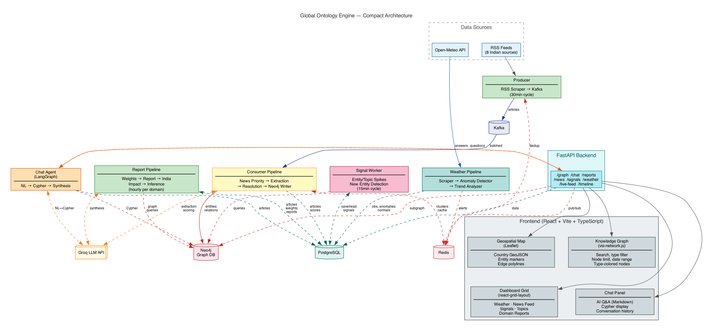
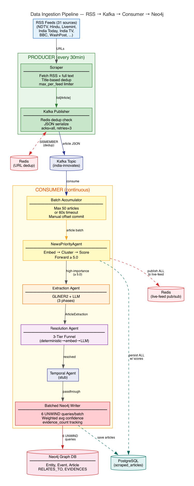
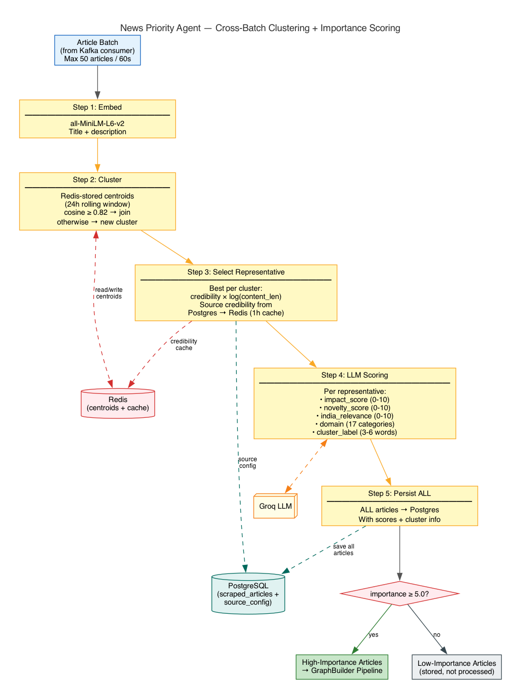
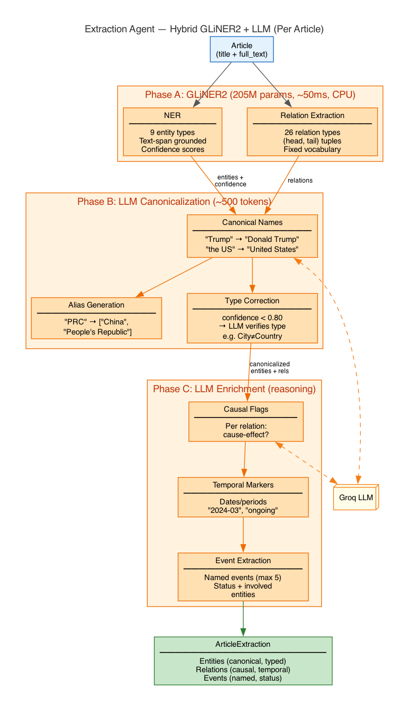
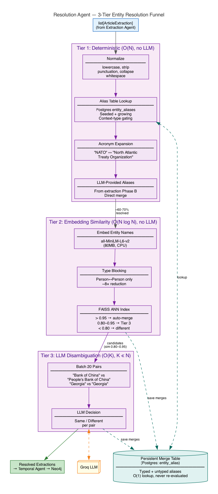
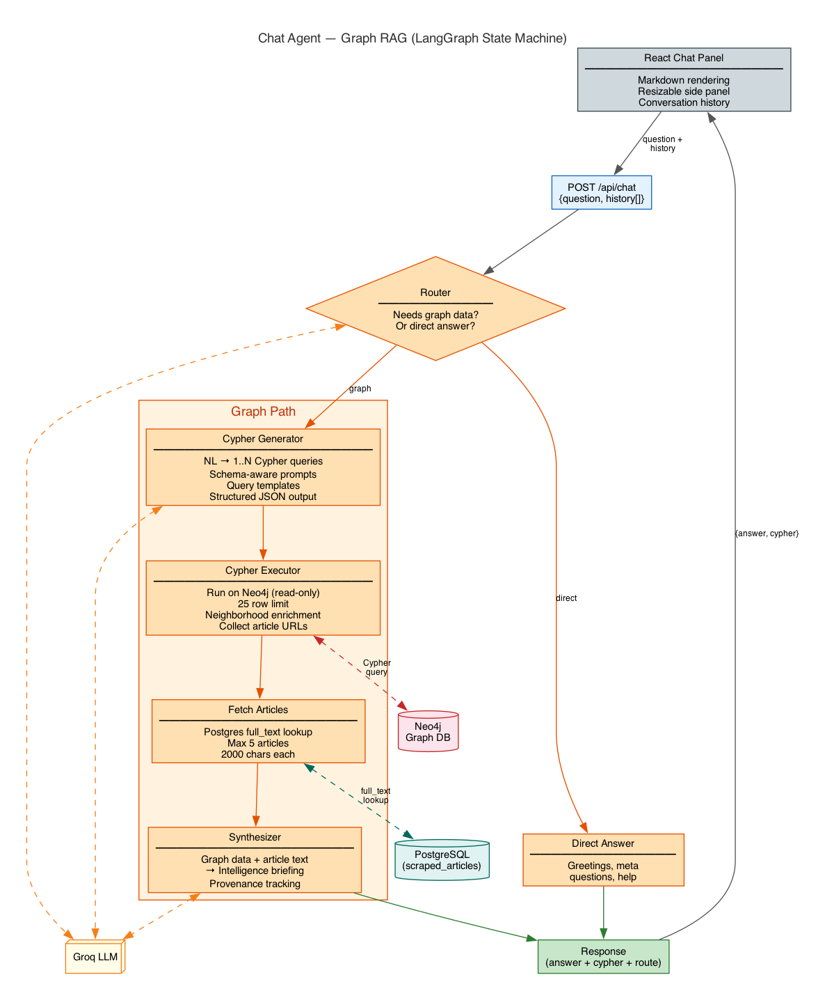
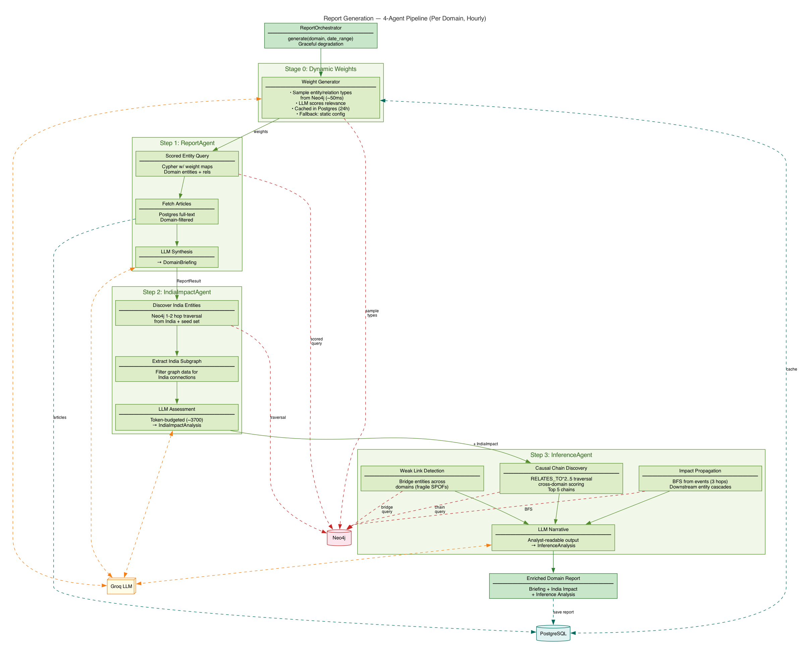
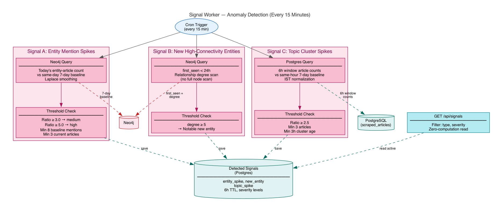
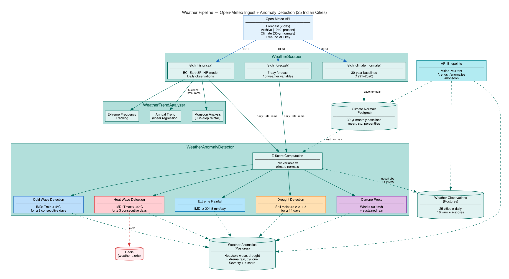

# Global Ontology Engine — Architecture Overview

An AI-powered intelligence graph that ingests global news, extracts entities and typed relationships, resolves them across sources, tracks temporal changes, and enables conversational querying over the knowledge graph. The system powers strategic Q&A, automated report generation, real-time anomaly detection, news prioritisation, and India-focused weather monitoring.

---

## System Overview (Compact Architecture)



The system runs as **6 independent processes** that communicate through Kafka (message queue), Redis (pub/sub + caching), PostgreSQL (relational storage), and Neo4j (graph database):

| # | Process | Schedule | Role |
|---|---------|----------|------|
| 1 | **API Server** | Always on | FastAPI serving REST + WebSocket endpoints |
| 2 | **News Producer** | Every 30 min | Scrapes RSS feeds → Kafka |
| 3 | **News Consumer** | Continuous | Kafka → Priority scoring → Graph extraction → Neo4j |
| 4 | **Report Scheduler** | Every 1 hr | Multi-agent intelligence report generation |
| 5 | **Weather Producer** | Every 6 hr | Open-Meteo → anomaly detection → Postgres |
| 6 | **Signal Worker** | Every 15 min | Anomaly/spike detection across graph + articles |

**Infrastructure dependencies:** PostgreSQL, Redis, Neo4j, Apache Kafka.

---

## 1. Data Ingestion Pipeline



### How it works

The ingestion pipeline is the entry point for all news data. It decouples scraping from processing using Kafka as a message broker.

**Producer** (`scheduler/producer.py`):
- Runs every 30 minutes (configurable via `SCRAPE_INTERVAL_SECONDS`).
- Fetches articles from **20+ RSS feeds** including Washington Post, BBC, NDTV, India Today, The Hindu (7 section feeds), Live Mint (5 feeds), and Economic Times.
- The `NewsRSSScraper` downloads full article text via `newspaper3k` using parallel thread pools.
- **Cross-source dedup**: Titles are normalized (lowercase, strip punctuation, first 8 meaningful words) to prevent duplicate stories from different outlets.
- **Redis URL dedup**: Before publishing, each article URL is checked against a Redis set (`SISMEMBER`). Only unseen URLs are published to Kafka.
- On first startup, the producer seeds the Redis seen-URL set from Postgres to avoid reprocessing historical articles.

**Kafka Topic** (`india-innovates`):
- Article JSON messages flow from producer → consumer.
- Decouples scraping cadence from processing speed — the consumer can take longer without blocking the producer.

**Consumer** (`scheduler/consumer.py`):
- Runs continuously, batching up to **50 articles** or waiting **60 seconds** (whichever comes first).
- `max_poll_interval_ms` set to 30 minutes to accommodate slow LLM processing without Kafka rebalancing.
- Two-stage processing: (1) NewsPriorityAgent scores/filters, (2) GraphBuilder extracts and saves.
- **ALL articles** (regardless of importance) are published to Redis `india-innovates:live-feed` channel for real-time UI streaming.
- Kafka offsets committed manually only after successful processing.

---

## 2. News Priority & Clustering



### How it works

The `NewsPriorityAgent` sits between Kafka consumption and graph extraction, acting as a quality gate that filters out noise (celebrity gossip, local crime, sports) and deduplicates stories across sources.

**Step 1 — Embedding**: Article titles + descriptions are embedded using `all-MiniLM-L6-v2` (80MB, CPU). This produces 384-dimensional semantic vectors.

**Step 2 — Cross-batch clustering**: Each article embedding is compared against all active cluster centroids stored in Redis (24-hour rolling window). If cosine similarity ≥ 0.82, the article joins an existing cluster; otherwise, a new cluster is created. Centroids are updated as a rolling average, so cluster representations drift with incoming content.

**Step 3 — Representative selection**: For each cluster, the best article is selected using `credibility × log(content_length)`. Source credibility scores come from a Postgres `source_config` table and are cached in Redis for 1 hour. Unknown sources default to 0.70.

**Step 4 — LLM scoring**: Each cluster representative gets a structured Groq LLM call that returns:
- `impact_score` (0–10): Structural scale of geopolitical/economic impact
- `novelty_score` (0–10): Historical precedent level
- `india_relevance` (0–10): Strategic impact on India
- `domain`: One of 17 standard domains (geopolitics, defense, economics, technology, energy, health, etc.)
- `cluster_label`: 3–6 word topic label

**Composite score formula**: `0.5 × impact + 0.2 × novelty + 0.3 × india_relevance`, with domain-weight multipliers and a coverage-density bonus.

**Step 5 — Persistence & gating**: ALL articles are saved to Postgres with their scores. Only articles with `importance_score ≥ 5.0` are forwarded to the GraphBuilder extraction pipeline.

---

## 3. Extraction Agent (Hybrid GLiNER2 + LLM)



### How it works

The Extraction Agent performs three-phase extraction per article. GLiNER2 handles the mechanical span-based extraction, while two lightweight LLM calls handle reasoning tasks.

**Phase A — GLiNER2 NER + RE** (~50ms/article, CPU):
- Uses the GLiNER2 model (205M parameters) for combined entity extraction (9 types: Person, Organization, Country, Location, Policy, Technology, Economic_Indicator, Military_Asset, Resource) and relation extraction (26 fixed geopolitical relation types: `sanctions`, `allied_with`, `opposes`, `trades_with`, `supplies_to`, `invaded`, `leads`, `founded`, etc.).
- Text-span grounded — zero hallucinated entity names, every extraction points to actual text in the article.
- Returns entities with per-span confidence scores and relations as (head, tail, type) tuples.
- Confidence threshold of 0.3 filters out garbage extractions.

**Phase B — LLM Canonicalization** (~500 tokens round-trip):
- GLiNER2 returns raw text spans ("Trump", "the US", "PLA"). This phase sends entity names **with their confidence scores** to the LLM for:
  - **Canonical names**: "Trump" → "Donald Trump", "the US" → "United States"
  - **Alias generation**: "People's Republic of China" → aliases: ["PRC", "China"]
  - **Confidence-gated type correction**: For entities where GLiNER2 confidence < 0.80, the LLM verifies and corrects the entity type (e.g. "Indian Ocean" Country→Location, "US Senate" Country→Organization).
- 3-attempt retry with exponential backoff, 60s timeout.

**Phase C — LLM Enrichment** (reasoning tasks):
- Given canonicalized entities and relations, the LLM performs:
  - **Causal flag classification**: Is each relation cause-effect? ("because", "in response to")
  - **Temporal marker attachment**: Dates or periods ("2024-03", "ongoing")
  - **Event extraction**: Named events with status and involved entities (max 5 per article)

**Performance comparison**:
| Aspect | LLM-only (before) | GLiNER2 + LLM (after) |
|--------|-------------------|----------------------|
| Entity speed | ~5s/article | ~50ms/article |
| Entity grounding | Hallucination-prone | Text-span grounded |
| Total per article | ~8s | ~3–4s |

---

## 4. Entity Resolution Agent (3-Tier Funnel)



### How it works

The Resolution Agent merges duplicate entities across articles using a cost-efficient cascade — cheap deterministic checks first, expensive LLM calls only when needed.

**Tier 1 — Deterministic Normalization** (O(N), no LLM, ~60–70% of merges):
- Looks up a type-gated merge table `(alias, context_type) → canonical` loaded from the Postgres `entity_aliases` table.
- Handles acronym expansion: "NATO" ↔ "North Atlantic Treaty Organization".
- Registers LLM-provided aliases from the extraction phase into the alias table.
- Context-type gating: "Georgia" resolves to "Georgia (state)" only when `type=Location`, not when `type=Country`.
- The alias table is seeded with common geopolitical aliases and grows over time as resolutions are learned.

**Tier 2 — Embedding Similarity** (O(N log N), no LLM):
- Embeds entity names using `all-MiniLM-L6-v2` (sentence-transformers).
- **Type-blocking**: Only compares entities of the same type (Person↔Person, Country↔Country), providing ~8x reduction in comparisons.
- Thresholds:
  - Cosine > 0.95 → auto-merge
  - Cosine 0.80–0.95 → candidate pair for Tier 3
  - Cosine < 0.80 → different entities

**Tier 3 — LLM Disambiguation** (O(K), K ≪ N):
- Batches up to 20 ambiguous pairs per LLM call.
- Presents pairs with similarity scores for definitive merge/no-merge decisions.
- Example: `"Bank of China" (Org) vs "People's Bank of China" (Org)` → no merge; `"US" (Country) vs "United States" (Country)` → merge.
- All merge decisions are persisted to Postgres, so they become Tier 1 lookups in future batches (learning system).

**Bonus — Graph-based resolution**: After all tiers, Neo4j structural similarity checks: same type + 3+ shared neighbors + never co-occur in the same article → likely the same entity.

---

## 5. Chat Agent (LangGraph Graph RAG)



### How it works

The Chat Agent provides conversational Q&A over the knowledge graph using a LangGraph state machine with 6 nodes.

**Router Node**: The LLM classifies each question as `"graph"` (needs Neo4j data) or `"direct"` (greeting, meta-question). Direct questions get an immediate response; graph questions proceed to Cypher generation.

**Cypher Generator Node**: A detailed system prompt includes the full Neo4j schema, 26 relationship types, entity types, and query pattern templates. The LLM generates 1..N independent Cypher queries via structured JSON output (`CypherQueryPlan`). Complex questions like "tell me about entity X" are decomposed into separate outgoing/incoming/events queries to avoid Cartesian product explosions.

**Cypher Executor Node**: Runs generated Cypher on Neo4j with safety guards (read-only queries only — mutation keywords rejected). Results limited to 25 rows per query. **Neighborhood auto-enrichment**: If initial results are thin (just name/type), the agent automatically fetches relationships, events, and source articles for mentioned entities. Collects article URLs from graph records.

**Fetch Articles Node**: Looks up article full text from Postgres `scraped_articles` table. Truncates to 2000 chars per article, maximum 5 articles. This gives the synthesizer deeper context beyond just graph structure.

**Synthesizer Node**: Combines graph data + article content into an intelligence briefing-style answer. Supports conversation history for follow-up questions.

**Endpoint**: `POST /api/chat` — `{question, history[]}` → `{answer, cypher, route}`

---

## 6. Report Generation Pipeline



### How it works

The Report Generation Pipeline is a **3-agent orchestrated workflow** that produces domain-specific intelligence reports with India-focused strategic analysis and cross-domain inference.

**ReportOrchestrator** (`agents/report_orchestrator.py`) coordinates three agents sequentially, with fault-tolerant fallbacks — if later agents fail, the report still includes the domain briefing.

### Step 1: ReportAgent — Domain Intelligence Briefing
- **Dynamic domain weights**: Instead of static config, the agent samples entity/relation types from recent graph data, then asks the LLM to score each type's relevance to the domain (0.0–1.0). Weights are cached per domain per day in Postgres (`domain_weight_cache`).
- **Cypher-side scoring**: Entity relevance scoring happens entirely in Cypher via native map parameter lookups (`score = type_weight × 0.4 + avg(rel_weight) × 0.6`), avoiding pulling data to Python for filtering.
- Fetches top-scored entities, their relationships, events, and associated article full text from Postgres.
- LLM synthesizes a `DomainBriefing` with: executive_summary, key_developments (5–8), key_actors (5–10), critical_relationships (5–8), and trends.

### Step 2: IndiaImpactAgent — India Strategic Assessment
- **Graph-driven entity discovery**: Traverses 1–2 hops from the "India" node in Neo4j via RELATES_TO edges, plus matches a 40+ item static seed set (Modi, ISRO, RBI, Indian Army, etc.).
- Filters the domain's graph data for India-connected relations and events.
- Articles ranked by count of India-entity mentions in title + excerpt.
- LLM produces `IndiaImpactAnalysis`: strategic_assessment, transparency_insights, national_advantages, risk_assessments (with severity/mitigation), global_positioning (with trajectory), and 5–8 actionable recommendations.
- Token-budgeted prompt (~3700 tokens max) ensures reliable LLM calls.

### Step 3: InferenceAgent — Causal Chain Discovery
- **Pure Cypher, LLM-last design** — Steps 1–3 are graph algorithms; the LLM only narrates results.
- **Causal chains**: Variable-length RELATES_TO paths (2–5 hops) filtered to `causal=true` edges. Scored by `Π(confidence) × log(evidence_count) × type_diversity`. Falls back to mixed causal/non-causal if pure chains are sparse.
- **Impact propagation**: BFS from recent events through 1–3 relationship hops to find downstream affected entities.
- **Weak link detection**: Bridge entities connecting different domain clusters with low connectivity — single points of failure in the geopolitical network.
- Single LLM call (~3500 tokens) synthesizes analyst-readable narratives for chains, impact cascades, and weak links.

**Output**: A merged JSON report containing domain briefing + `india_impact` + `inference` sections. Generated hourly for 5 domains: climate, defence, economics, geopolitics, society.

**Endpoints**: `GET /api/reports` (list domains), `GET /api/reports/{domain}` (fetch report).

---

## 7. Signal / Anomaly Detection



### How it works

The Signal Worker (`scheduler/signal_worker.py`) runs every 15 minutes as a standalone background process, detecting three types of real-time anomalies:

### Signal A — Entity Mention Spikes (Neo4j)
- Compares today's entity-article count vs the **same-day 7-day baseline** (not daily average, to avoid time-of-day news cycle bias).
- **Laplace smoothing** on the denominator prevents division-by-zero and dampens small-number false positives.
- Guards: minimum 8 baseline mentions (skip obscure entities), minimum 3 current mentions (a single article can never trigger a spike).
- Ratio ≥ 3.0 → medium severity; ≥ 5.0 → high severity.

### Signal B — New High-Connectivity Entities (Neo4j)
- Finds entities first seen within the last 24 hours that already have ≥ 5 graph connections.
- Uses relationship scan (not property scan) to avoid full index-less node scans — checking `first_seen` property plus degree count.
- New entities with high connectivity suggest a previously unknown player entering the geopolitical stage.

### Signal C — Topic Cluster Spikes (Postgres)
- Compares topic cluster article counts in **6-hour windows** (not 2h — smooths over scraper batch cadence) against same-hour 7-day baseline.
- Minimum cluster age of 3 hours (brand-new clusters can't "spike").
- Ratio ≥ 2.5 with minimum 3 current articles.

All detected signals are persisted to Postgres `detected_signals` table with a **6-hour TTL**. The `/api/signals` endpoint reads them directly — zero computation at request time.

**IST normalization**: All time comparisons use UTC+5:30 to align with Indian news cycles.

---

## 8. Weather Monitoring Pipeline



### How it works

The Weather Pipeline monitors weather conditions across **25 Indian cities** spanning all major climate zones (plains, coastal, hills), detecting anomalies using statistical methods and IMD (India Meteorological Department) thresholds.

### Data Collection — WeatherScraper (`scrapers/weather.py`)
- Fetches data from **Open-Meteo** (free, no API key) using three API endpoints:
  - Historical archive (1940–present)
  - 7-day forecast
  - 30-year climate normals (EC_Earth3P_HR model, 1991–2020)
- **16 daily weather variables**: temp max/min/mean, apparent temp, precipitation, rain, snowfall, wind speed/gusts, humidity, soil moisture, evapotranspiration, radiation, weather code.
- Cities fetched in batches of 5 to avoid timeouts; uses `requests_cache` (1h TTL) and retry logic.

### Anomaly Detection — WeatherAnomalyDetector (`agents/weather_anomaly.py`)
- **Z-score computation**: Per-variable z-scores against monthly climate normals `(observed - mean) / std`.
- **IMD-aligned detection rules**:
  - **Heat waves**: Zone-aware thresholds (plains: Tmax ≥ 40°C for ≥3 consecutive days)
  - **Cold waves**: Tmin < 4°C for ≥3 consecutive days
  - **Extreme rainfall**: ≥204.5 mm/day (IMD "extremely heavy" category)
  - **Drought**: Soil moisture z-score < -1.5 for ≥14 consecutive days
  - **Cyclone proxies**: Wind speed ≥ 90 km/h + sustained rain
- **Consecutive exceedance grouping**: Groups qualifying days into events with start/end dates, peak values, and severity levels (warning/severe/extreme).

### Trend Analysis — WeatherTrendAnalyzer
- Annual trend detection via linear regression.
- Monsoon analysis (June–September rainfall patterns, deficit tracking).
- Extreme frequency tracking over time.

### Data Storage
| Table | Contents |
|-------|----------|
| `weather_observations` | 25 cities × daily: 16 weather vars + z-scores, upserted by (city, date) |
| `weather_anomalies` | Detected events: heat wave, cold wave, drought, extreme rain, cyclone proxy |
| `climate_normals` | 30-year monthly baselines: mean, std, percentiles per city × variable |

### Endpoints
| Endpoint | Description |
|----------|-------------|
| `GET /api/weather/cities` | List 25 monitored Indian cities |
| `GET /api/weather/current` | Latest observation + anomaly flags for all cities |
| `GET /api/weather/trends/{city}` | Trend analysis (7d, 30d, 1y, 5y) |
| `GET /api/weather/{city}/anomalies` | Detected weather anomalies for a city |
| `GET /api/weather/monsoon` | Monsoon season analysis |

### Bootstrap
```bash
# One-time: compute 30-year climate normals (~2-5 min)
uv run python -m scheduler.weather_producer --bootstrap-normals
# Optional: backfill historical observations
uv run python -m scheduler.weather_producer --backfill --years 5
```

---

## Neo4j Graph Schema

The knowledge graph uses three node types and five relationship patterns:

### Nodes

| Label | Key Properties |
|-------|---------------|
| **Entity** | `name`, `type`, `first_seen`, `last_updated` |
| **Event** | `name`, `date`, `status` (ongoing/concluded) |
| **Article** | `url`, `title`, `source`, `pub_date` |

### Entity Types
Person, Organization, Country, Location, Event, Policy, Technology, Economic_Indicator, Military_Asset, Resource

### Relationships

| Pattern | Properties |
|---------|-----------|
| `(Entity)-[:RELATES_TO]->(Entity)` | `type` (verb phrase from 26 fixed types), `since`, `confidence`, `causal`, `current` |
| `(Entity)-[:INVOLVED_IN]->(Event)` | — |
| `(Article)-[:EVIDENCES]->(Entity)` | — |
| `(Article)-[:EVIDENCES]->(Event)` | — |
| `(Article)-[:EVIDENCES_REL]->(Entity)` | `relation_type` |

### Fixed Relationship Vocabulary (26 types)
`sanctions`, `allied_with`, `opposes`, `trades_with`, `supplies_to`, `invaded`, `leads`, `founded`, `acquired`, `located_in`, `manufactures`, `funds`, `threatens`, `negotiates_with`, `member_of`, `disrupts`, `signed_agreement_with`, `deployed_to`, `develops`, `exports_to`, `imports_from`, `cooperates_with`, `competes_with`, `attacks`, `blocks`, `supports`

Every edge traces back to source articles via `EVIDENCES` — click any entity or relationship to see all supporting articles.

---

## Technology Stack

| Layer | Technology |
|-------|-----------|
| **API Framework** | FastAPI + Uvicorn |
| **Graph DB** | Neo4j 5 |
| **Relational DB** | PostgreSQL 17 (via SQLAlchemy + Alembic) |
| **Message Queue** | Apache Kafka |
| **Cache / Pub-Sub** | Redis 7 |
| **NER / RE** | GLiNER2 (205M params, CPU) |
| **Embeddings** | all-MiniLM-L6-v2 (sentence-transformers) |
| **LLM** | Groq API (structured JSON output mode) |
| **Agent Framework** | LangGraph (chat agent state machine) |
| **News Scraping** | feedparser + newspaper3k |
| **Weather Data** | Open-Meteo API (free, no key) |
| **Frontend** | vis-network.js (graph viz), HTML/JS |
